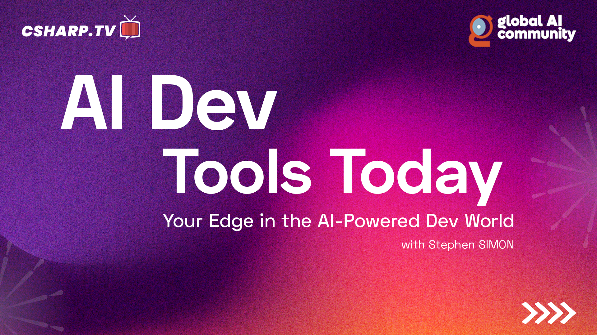

# AI-Dev-Tools-Today
AI Dev Tools Today is a fast-paced, 20-minute show where developers, builders, and innovators explore the latest AI-powered tools transforming software development.

Each episode features a guest from the AI or dev tool ecosystem who shares hands-on demos, practical workflows, and real-world use cases to help you code smarter, ship faster, and build better with AI.

Whether you're an engineer curious about integrating AI into your stack, or a founder building the next-gen dev tool — this show gives you the insights, tools, and inspiration to stay ahead.

